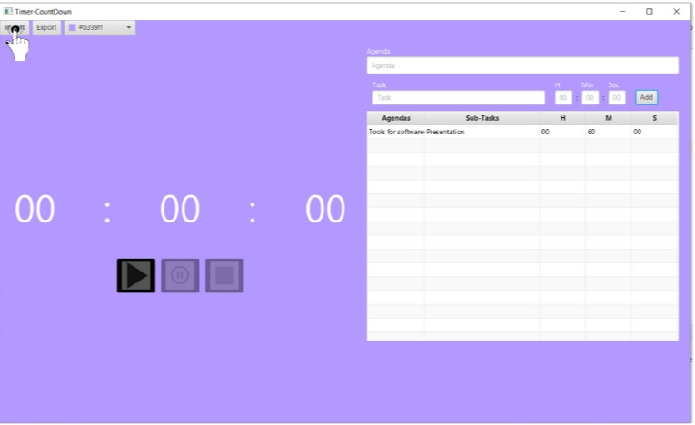

**Time Blocks**
==============

**Introduction**
==============

Welcome to "**Time Blocks**".

<h4>Time Blocks is a timer task application which allows the user to schedule task easily with any duration the user wants.
Time Blocks has been developed by three developers where we have built additional features on this application which includes importing and exporting the tasks to and from a .CSV file and also allowing the user to choose the background colour from the colour palette. </h4>

How to Run?
=============

**Time Blocks** is an open source application that is being hosted on GITLAB.

**Pre-Requisites**

- SSH / HTTPS Git Key - Found in **My Projects** in your account, if you were granted access by the developer.
  - **Java JDK** as well as **JavaFX** present on your computer.
- If you have not installed Java JDK or JavaFX, the links to download them are provided below:  
  - **JDK** [https://www.oracle.com/java/technologies/javase-downloads.html](url)  
  - **JavaFX** [https://gluonhq.com/products/javafx/](url)  
- An Integrated Development Environment (**IDE**) is required to interact and run this application. - The preferred **IDE**(s) are IntelliJ and Eclipse. Both of these **IDE**s are free to download and use. The links to download them are below:  
  - IntelliJ - [https://www.jetbrains.com/de-de/idea/download/](url)  
  - Eclipse - [https://www.eclipse.org/downloads/](url)  
- A terminal or a command line is also needed to clone the repository available for this application. If you are using Windows, Command Prompt can be used for this purpose. If you are using Mac or Linux, you can open your Terminal.  

**Step 1 : Cloning repository**
=============================

Run this specific command below in your terminal or command prompt  
<strong>Git clone HTTP/SSH Key </strong>  
Do take note that you will have to replace HTTP/SSH Key, with the Key that you get from your **My Projects**.  
This command will then clone the entire repository to the downloads folder or a specified folder if you have specified it.  

**Step 2 : Setting up IDE**
===========================
Follow the steps as followed if you have not installed an **IDE**
- Download an **IDE** from the links [https://www.jetbrains.com/de-de/idea/download/](url) or [https://www.eclipse.org/downloads/](url) as mentioned above and install it.

If you have an **IDE** installed, follow these steps instead:
- Open an **IDE** that you have installed.
- Import the project that you have cloned previously.
- Choose a version of JDK if it has not been assigned automatically by your **IDE**.

**Step 3 : Importing JavaFX Library**
=====================================
> To run the application, you are required to have JavaFX as a User Library installed in your system.

Below this are steps onto how you can import the  JavaFX Library that you have downloaded previously.  

<strong> IntelliJ </strong>
- Click File, then Click Project Structure. After which you click Libraries under project settings where you click + icon and then click Java.  
Altenatively you can access the Project Structure by pressing <strong>CTRL+ALT+SHIFT+S</strong>.  
- Following this, you are going to navigate to your JavaFX Library Folder in the file chooser. Choose the necessary modules that will be required to run this application which should include "Time Blocks".  
- Once you are done, click OK which should close the dialog box.  

> If you are using a version of Java that is 11 or higher  

- Navigate to your VM which is at Edit Configurations under Run.  
- In the VM options box, type --module path "Path-File" --add-modules javafx.controls, javafx.fxml  
Do take note that Path-File is to be replaced with the path of your library for JavaFX.  
- Once you have done this, click apply and then close the dialog box.  

<strong> Eclipse </strong>
- Go to Project and then choose Properties and then click on Java Build Path and then choose Libraries.
- Now go to the classpath folder and click Add Library, choose User Library from the options provided in the dialog box. If JavaFX was installed properly, it should show up when you have clicked next.
- Select the checkbox for JavaFX.
- Click Finish and that will close the dialog box.  
> Now you need to add the external JARs that will be needed for the application to run.  

- Navigate back to Java Build Path which is under Project and Properties, and choose Libraries again.
- Click on JavaFX and expand the library. If no JARs are present you will need to do the following steps. 
- Click on JavaFX and select add External JARs, once you do a dialog box will open and you will need to navigate to the library of where you downloaded your JavaFX at.
- Select all of the .jar files in the /lib folder excluding the src zip or rar file. 
- Click Apply and close the dialog box.
> You should now be able to run the application.  

**Step 4 : Running "Time Blocks"**
==================================

- In IntelliJ IDE  
  Press Shift + F10 on your keyboard to run the application.  

- In Eclipse IDE  
 Press Ctrl + Shift + X or Ctrl + Shift + J to run the application.  

**HOW TO USE THE APP**
=====================================
The **Time-Blocks** application is easy to use, user friendly and comes loaded with a lot of exciting features:
- The app has a _**Countdown timer**_ in hours. minutes and seconds.
- The app allows you to _**create Agenda**_ and _**assign a subtask**_ with a _**time limit**_ to it.
- User Can _**import and export**_ <strong>.CSV<strong> files to add your tasks to the app.
- User can also set a _**background color**_ of your choice.
- The app has the following _**inbuilt alerts**_
  - **In the last 10 seconds the timer starts to fade**
  - **In the last 10 seconds the timer plays a Countdown sound**
  - **When the timer is finished it plays an alert sound**

 **1. Create an  _Agenda_ and _assign a subtask_ with a _time limit_**
==========================================================
- User can enter the **Agend**, **task** and **time limit** in the **_text fields_** localted on the **right section** of the app
- After providing all the details <mark>select-><strong>add<strong><mark> button your Agenda, task and time limit will be added to the list
  

 **2. Delete a task**
==========================================================
- User can  <mark>**select -> tasks -> delete**<mark> button to delete a task
- On successfull deletion a message is dipslayed

 **3. Run the Timer**
==========================================================
- To **_run_** the **timer** user has to select a task fromt the tasklist, then the play button will be enabled
- <mark>select-><strong>PLAY<strong><mark> button to **start** the timer.
- The timer starts the count down, user can **_stop_** the timer by <mark>select-> <strong>STOP<strong><mark> button
- To **_terminate_** the timer user can <mark>select-><strong>TERIMINATE<strong><mark> button
  

**4. import CSV file**
==========================================================
- To _**import**_ the CSV <mark>select->import<mark>
- a new window will open <mark>select-> your .CSV file<mark>
 
 

**5. Export CSV file**
==========================================================
- To export a CSV file add your tasks <mark>Select->export<mark>.
 

**6. Set background color**
==========================================================
- User can set a background color of their chocie by: <mark>Select->Color<mark>
 

